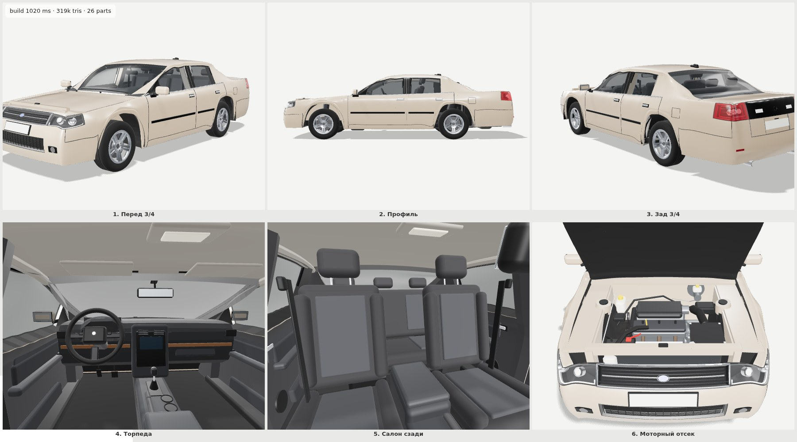

# The Long Road

Survival road-trip game inspired by *The Long Drive* (Three.js + Rapier, single-file HTML build).

**Play:** open `release/the-long-road.html` in a desktop browser (one self-contained file).

## Development

```bash
npm install
npm run dev        # game at http://localhost:5173/, car studio at /studio.html
npm run build      # dist/index.html — single self-contained file
npm run typecheck
```

## Layout

| Path | What |
| --- | --- |
| `src/legacy/game.js` | Game code recovered from the original build (minified names are legacy; reworked systems move out into `src/`) |
| `src/car/` | The sedan, generated from scratch: subdivision-surface body (`body/`, `mesh/`), details (`details/`), part catalogue (`parts.ts`), game adapter (`legacy.ts`) |
| `src/studio/` | Car studio & critic: reference-style six-frame sheet, orbit view, see-through hole detector |
| `tools/debundle/` | Recovers sources from the single-file build by fingerprinting it against three@0.186.0 / rapier3d-compat@0.20.0 |
| `tools/shots.mjs` | Headless screenshots of the running dev server (used for every visual check) |
| `reference/` | Original build, car reference sheets, design feedback |

### Car studio

- `/studio.html` — contact sheet: front 3/4, profile, rear 3/4, dashboard, cabin, engine bay (hood open)
- `/studio.html?view=orbit` — free orbit; `&open=hood,door_fl` / `&hide=bumper_f` toggle parts
- `/studio.html?view=holes` — renders the car flat white on black from 8 directions and counts enclosed background pixels (see-through gaps)


